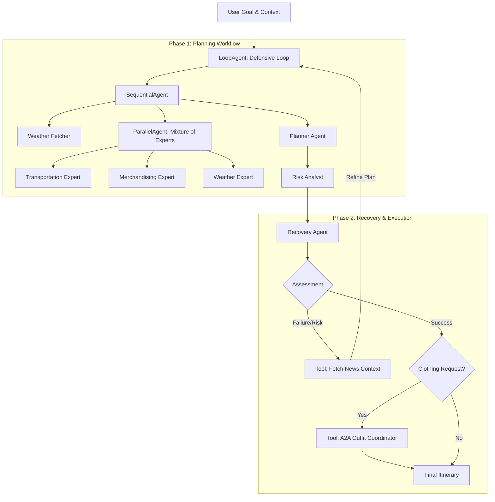

# 🚨 B.RED.DY - The Defensive Planner Agent

> _"Ensuring your Plan B doesn't turn red"_

[](https://www.kaggle.com/competitions/agents-intensive-capstone-project)
[](https://github.com/google/adk-python)
[](https://deepmind.google/technologies/gemini/)
[](https://opensource.org/licenses/MIT)

## 🏆 Project Overview
**Track:** Concierge Agents

**B.RED.DY** (Defensive Planner) is a resilient Multi-Agent System designed to solve a critical problem in personal planning: **fragility**.

Most planning agents assume a "happy path"—perfect weather, available tickets, and smooth traffic. **B.RED.DY** assumes everything will go wrong. Using a "Defensive Loop" architecture, it proactively checks for risks, simulates execution, and employs a Recovery Agent to fix issues or suggest alternatives *before* you even leave the house.

### 🔑 Key Value Proposition
*   **Anticipates Failure:** Doesn't just plan; it stress-tests the plan against simulated risks (weather, traffic, inventory).
*   **Automated "Plan B":** Saves hours of frantic re-booking by having a Recovery Agent ready to pivot.
*   **Social Harmony:** Includes Agent-to-Agent (A2A) coordination to prevent social conflicts (like showing up in the same outfit).

---

## 🏗️ Architecture

The system uses a **Loop-based Orchestrator** where distinct agents collaborate to create, critique, and fix plans.



### The "Defensive Loop"
1.  **Planning:** Specialized experts (Transport, Weather, Merch) analyze the request in parallel.
2.  **Synthesis:** The Planner Agent creates an initial itinerary.
3.  **Risk Analysis:** The Risk Analyst critiques the plan (e.g., "Flight connection too tight given storm warning").
4.  **Recovery:** If risks are high or tools fail, the Recovery Agent intervenes to adjust the plan or coordinate with other agents.

---

## 🚀 Key Features

### 1. Multi-Agent Orchestration
Leverages the full power of the Google Agent Development Kit (ADK):
*   **`SequentialAgent`**: For linear workflows (Plan → Risk).
*   **`ParallelAgent`**: For concurrent expert consultation (Mixture of Experts pattern).
*   **`LoopAgent`**: For the defensive retry mechanism.

### 2. Chaos Engineering
To prove resilience, the system uses custom tools with built-in failure modes:
*   `book_taxi` (20% failure rate)
*   `purchase_tickets` (30% failure rate)
*   `get_weather_forecast` (10% failure rate)
*   **Result:** The agent *must* handle these errors gracefully, demonstrating robust error recovery.

### 3. Agent-to-Agent (A2A) Coordination
Demonstrates social intelligence using shared session state.
*   **Scenario:** Two users (Alice and Bob) planning for the same event.
*   **Conflict:** Both want to wear red.
*   **Resolution:** The agents communicate via `InMemorySessionService`, detect the conflict, and Bob's agent negotiates a "Navy Blue" alternative automatically.

### 4. Observability
Includes a custom `MetricsCollector` and `@trace_tool` decorators to log every decision, tool call, and state change, proving that the *agents* (not hardcoded logic) are in control.

---

## 🛠️ Installation & Usage

### Prerequisites
*   Python 3.10+
*   Jupyter Notebook environment
*   Google Gemini API Key

### Setup

1.  **Clone the repository:**
    ```bash
    git clone https://github.com/yourusername/breddy.git
    cd breddy
    ```

2.  **Install dependencies:**
    ```bash
    pip install -r requirements.txt
    ```

3.  **Configure API Key:**
    Set your Google Gemini API key in the notebook or environment variables.

4.  **Run the Notebook:**
    Launch `breddy.ipynb` to see the agents in action.

### Running Scenarios
The notebook includes 5 pre-configured scenarios of increasing complexity:

| Scenario | Complexity | Description |
| :--- | :--- | :--- |
| **1. The Art Exhibition** | ⭐ | Happy path. Simple planning and execution. |
| **2. The Flight Connection** | ⭐⭐ | Weather disruption handling. Reroutes transport based on storm warnings. |
| **3. The Date Night** | ⭐⭐ | Inventory failure. Handles "Sold Out" tickets by finding alternative venues. |
| **4. The Concert** | ⭐⭐⭐ | Multi-point failure. Handles traffic jams + parking issues simultaneously. |
| **5. A2A Social Conflict** | ⭐⭐⭐⭐ | **Advanced.** Two agent sessions coordinate to avoid an outfit clash. |

---

## 📂 Project Structure

*   `breddy.ipynb`: Main application notebook containing all agent logic, tools, and scenarios.
*   `ADR-DefensivePlanner.md`: detailed Architectural Decision Record explaining the design choices.
*   `examples/`: Reference notebooks for other agent patterns.
*   `training/`: Course materials and concept drills.

---

## 🌟 Future Roadmap
*   **MCP Integration:** Replace mock tools with real-world APIs via Model Context Protocol (Uber, OpenTable, WeatherAPI).
*   **Human-in-the-Loop:** Add an approval step for high-cost recovery decisions.
*   **Production Observability:** Export metrics to Google Cloud Operations or Datadog.

---

## ✍️ Author
**Oleg Smirnov**
*   [LinkedIn](https://linkedin.com/in/osmirnov)

_Submitted for the Kaggle AI Agents Intensive Capstone Project 2025_

